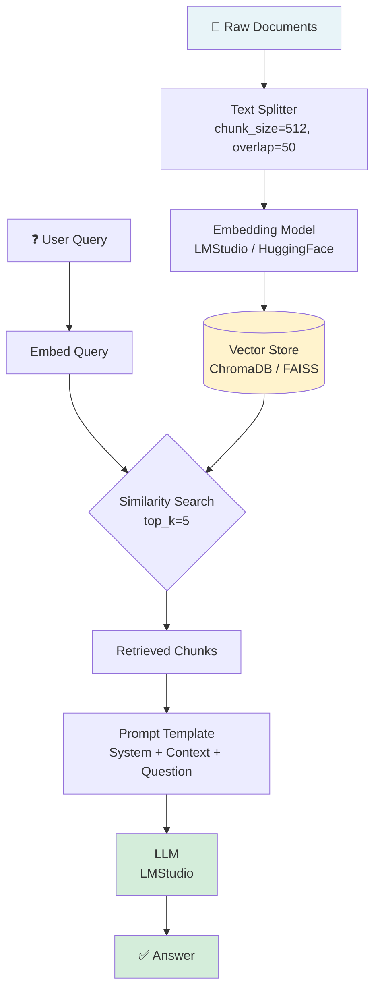
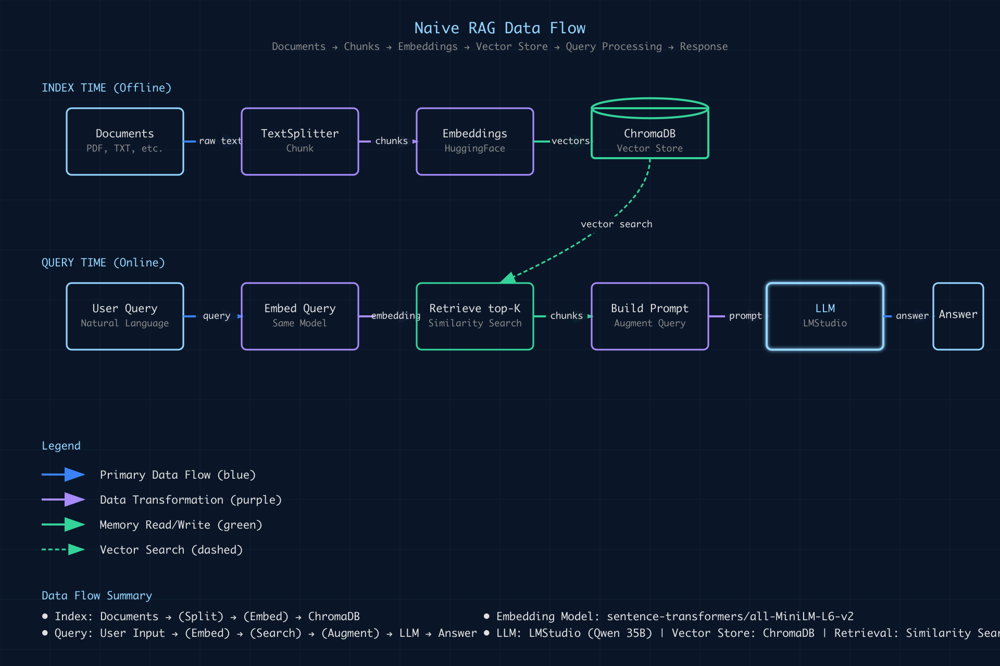

# 01 · Naive RAG (Simple RAG)

> **Category:** Foundational  
> **Complexity:** ⭐☆☆☆☆  
> **Latency:** 🟢 Low  
> **Accuracy:** 🟡 Moderate  
> **Reference:** [NirDiamant/RAG_Techniques — simple_rag.ipynb](https://github.com/NirDiamant/RAG_Techniques/blob/main/all_rag_techniques/simple_rag.ipynb)

---

## What Is It?

Naive RAG (also called Simple RAG) is the **baseline** retrieval-augmented generation pipeline. It introduces the foundational retrieve-then-generate pattern that all advanced RAG techniques build upon.

The pipeline has two phases:

**Offline (Indexing):** Documents are chunked, embedded, and stored in a vector database.  
**Online (Querying):** The user's query is embedded, matched against the vector store, and the top-K most similar chunks are injected into an LLM prompt to generate an answer.

---

## Flowchart



---

## Implementation Files

| File | Framework | Description | Lines |
|------|-----------|-------------|-------|
| `langchain_impl.py` | LangChain | LCEL chain with ChromaDB | 154 |
| `llamaindex_impl.py` | LlamaIndex | VectorStoreIndex + QueryEngine | 117 |
| `__init__.py` | Both | Clean exports of both implementations | 4 |

### Code Quality
- ✅ No unused imports
- ✅ Clear separation of concerns
- ✅ Consistent error handling
- ✅ Comprehensive logging
- ✅ Both implementations follow the same `BaseRAG` interface

### Framework Comparison

| Aspect | LangChain | LlamaIndex |
|--------|-----------|-----------|
| **Code clarity** | LCEL chain (functional) | QueryEngine (higher-level) |
| **Customization** | More granular control | Simplified abstractions |
| **Learning curve** | Steeper for LCEL | Gentler, more intuitive |
| **Production-ready** | ⭐⭐⭐⭐ | ⭐⭐⭐⭐ |
| **Community** | Larger, more resources | Growing, excellent docs |

**Choose LangChain if:** You want fine-grained control over each step and prefer functional composition patterns.

**Choose LlamaIndex if:** You want to move fast and prefer high-level abstractions that handle boilerplate automatically.

---

## Imports

Both implementations are cleanly exported from the package:

```python
# Direct import from package
from techniques.naive_rag import NaiveRAGLangChain, NaiveRAGLlamaIndex

# Or specific framework
from techniques.naive_rag.langchain_impl import NaiveRAGLangChain
from techniques.naive_rag.llamaindex_impl import NaiveRAGLlamaIndex
```

---

## Key Configuration (config.yaml)

```yaml
document:
  chunk_size: 512          # Characters per chunk
  chunk_overlap: 50        # Overlap between chunks

retrieval:
  top_k: 5                 # Number of chunks to retrieve
  search_type: similarity  # similarity | mmr
```

---

## Pros & Cons

| ✅ Pros | ❌ Cons |
|---------|---------|
| Simple to implement and debug | Retrieval quality depends entirely on embedding similarity |
| Low latency (single retrieval pass) | No query understanding or transformation |
| Good baseline for comparison | Sensitive to chunk size and overlap settings |
| Works well for small, focused document sets | Struggles with complex, multi-hop questions |
| Easy to swap components (LLM, embeddings, vector store) | May retrieve irrelevant chunks for ambiguous queries |

---

## When to Use Naive RAG

**✅ Perfect for:**
- Rapid prototyping and POC development
- Simple Q&A over a small, focused document corpus (< 1000 documents)
- When latency is critical and accuracy requirements are moderate
- Establishing a baseline before optimizing
- Internal tools where occasional misses are acceptable
- FAQ systems with well-structured documents

**❌ Avoid when:**
- Queries require multi-hop reasoning across documents
- Document vocabulary differs significantly from query vocabulary
- High accuracy is required (legal, medical, compliance)
- The knowledge base is very large (> 10,000 documents)
- Documents contain tables, charts, or complex structures

---

## Common Failure Modes

1. **Vocabulary mismatch** — Query says "revenue" but document says "income" → missed retrieval → consider HyDE or Query Transform
2. **Chunk boundary issues** — Key information is split across two chunks → increase chunk_overlap or use Parent Document RAG
3. **Top-K too small** — Relevant info is in rank 6-10 → increase top_k or use Reranking RAG
4. **Large documents with sparse information** — Retrieved chunks contain mostly irrelevant text → consider Contextual Compression RAG

---

## Quick Start

### LangChain Implementation

```python
from techniques.naive_rag.langchain_impl import NaiveRAGLangChain
from core.config_loader import ConfigLoader

rag = NaiveRAGLangChain(config=ConfigLoader.get())
rag.index(["Your document text here...", "Another document..."])
result = rag.query("What is the main topic?")
result.print_summary()
```

### LlamaIndex Implementation

```python
from techniques.naive_rag.llamaindex_impl import NaiveRAGLlamaIndex
from core.config_loader import ConfigLoader

rag = NaiveRAGLlamaIndex(config=ConfigLoader.get())
rag.index(["Your document text here...", "Another document..."])
result = rag.query("What is the main topic?")
result.print_summary()
```

### Via CLI

```bash
# LangChain
python scripts/run_technique.py --technique naive_rag --framework langchain --query "Your question"

# LlamaIndex
python scripts/run_technique.py --technique naive_rag --framework llamaindex --query "Your question"
```

---

## Architecture Notes (Senior Architect Perspective)

- **Embedding quality is the #1 lever** for improving naive RAG. A better embedding model (e.g., `nomic-embed-text`, `bge-large-en`) will outperform any retrieval trick with a weak embedding.
- **Chunk size matters more than most engineers expect.** Too small → chunks lack context. Too large → noise drowns out signal. Start with 512 tokens and tune based on your document structure.
- **ChromaDB is fine for < 100K documents.** Beyond that, consider FAISS (for speed) or Qdrant (for production scalability).
- **This should always be your first implementation** — it gives you the performance floor that all advanced techniques must beat to justify their added complexity.

## Data Flow Diagram

The complete Naive RAG pipeline consists of two phases:

### Offline Phase (Indexing)
**Documents → Chunks → Embeddings → Vector Store**

Raw documents are preprocessed once and stored for efficient retrieval. This phase happens when you first ingest your knowledge base.

### Online Phase (Query) 
**Query → Embedding → Similarity Search → Context Retrieval → LLM → Response**

When a user asks a question, it's embedded and compared against the vector store. The top-K most similar chunks are retrieved and injected into the LLM prompt to generate a context-aware answer.

