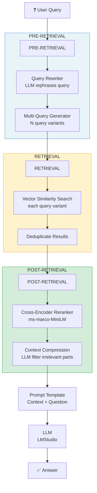

# 02 · Advanced RAG

> **Category:** Foundational / Production  
> **Complexity:** ⭐⭐⭐☆☆  
> **Latency:** 🟡 Medium (reranking adds ~200-500ms)  
> **Accuracy:** 🟢 High  
> **Reference:** [NirDiamant/RAG_Techniques](https://github.com/NirDiamant/RAG_Techniques)

---

## What Is It?

Advanced RAG wraps Naive RAG with three layers of optimization:

1. **Pre-Retrieval (Query Enhancement):** Rewrites or expands the query to better match document vocabulary and cover multiple angles of the question.
2. **Retrieval:** Uses multi-query retrieval to retrieve more candidates via N query variants, then deduplicates.
3. **Post-Retrieval:** Applies cross-encoder reranking to promote the most semantically relevant chunks, and optionally compresses context using an LLM filter.

---

## Flowchart



---

## Implementation Files

| File | Framework | Key Features |
|------|-----------|--------------|
| `langchain_impl.py` | LangChain | MultiQueryRetriever + CrossEncoderReranker |
| `llamaindex_impl.py` | LlamaIndex | SentenceWindowNodeParser + SentenceTransformerRerank |

---

## Key Configuration (config.yaml)

```yaml
rag_techniques:
  advanced_rag:
    query_rewriting: true    # Enable LLM query rewriting
    reranking: true          # Enable cross-encoder reranking
    compression: true        # Enable context compression

retrieval:
  top_k: 5                   # Final top-K after reranking
  rerank_top_k: 3            # Docs to keep after reranking

rag_techniques:
  reranking_rag:
    initial_top_k: 20        # Retrieve this many before reranking
    reranker_model: "cross-encoder/ms-marco-MiniLM-L-6-v2"
```

---

## Pros & Cons

| ✅ Pros | ❌ Cons |
|---------|---------|
| Significantly better recall via multi-query | Higher latency (2-3× vs. Naive RAG) |
| Cross-encoder reranking improves precision | Reranker requires additional model download |
| Query rewriting bridges vocabulary gap | More complex to debug and tune |
| Sentence window context improves coherence | More expensive in compute and API calls |

---

## When to Use Advanced RAG

**✅ Perfect for:**
- Production Q&A systems where accuracy matters
- Documents using different vocabulary than users (e.g., technical jargon vs. plain language)
- Enterprise knowledge bases with mixed document types
- Customer support, legal research, medical Q&A
- Any system where Naive RAG's accuracy is insufficient

**❌ Consider alternatives when:**
- Latency budget is very tight → Use Naive RAG
- Queries involve multi-hop reasoning across many documents → Use RAPTOR or GraphRAG
- Documents have complex relational structure → Use GraphRAG
- Need zero-shot routing → Use Adaptive RAG

---

## Architecture Notes

- **The reranker is the highest-ROI improvement** over Naive RAG. A cross-encoder evaluates each (query, document) pair jointly, unlike bi-encoders (used in vector search) that encode them separately. This produces much better relevance scores.
- **SentenceWindowNodeParser** (LlamaIndex) is particularly powerful — it retrieves at the sentence level for precision, but returns a larger surrounding window for context, giving the LLM enough information to generate a coherent answer.
- **Multi-query retrieval** is a cheap way to improve recall. The LLM generates 3-5 variations of the query, each of which retrieves different relevant documents. After deduplication, you have higher coverage with manageable latency overhead.
