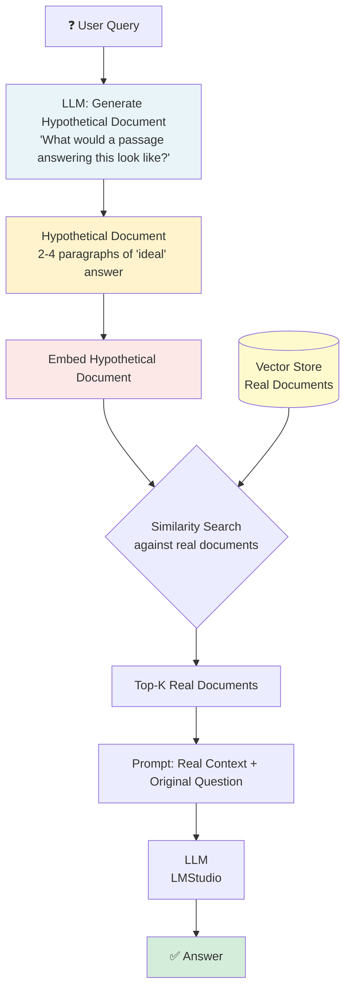

# 03 · HyDE RAG (Hypothetical Document Embeddings)

> **Category:** Query Enhancement  
> **Complexity:** ⭐⭐☆☆☆  
> **Latency:** 🟡 Medium (+1 LLM call for hypothetical generation)  
> **Accuracy:** 🟢 High (especially for vocabulary mismatch scenarios)  
> **Paper:** ["Precise Zero-Shot Dense Retrieval without Relevance Labels" — Gao et al. 2022](https://arxiv.org/abs/2212.10496)  
> **Reference:** [NirDiamant — HyDe_RAG.ipynb](https://github.com/NirDiamant/RAG_Techniques/blob/main/all_rag_techniques/HyDe_RAG.ipynb)

---

## What Is It?

HyDE solves the **vocabulary mismatch** problem in RAG. Standard RAG embeds the user's short query and finds similar document chunks. But short queries are stylistically very different from the long, detailed passages in most documents, so the embeddings may not align well.

HyDE's insight: **generate what an ideal answer would look like**, then use *that* as the retrieval query. A hypothetical answer and real documents are much more similar in vector space than a raw query and real documents.

---

## Flowchart

---

## Pros & Cons

| ✅ Pros | ❌ Cons |
|---------|---------|
| Dramatically improves recall for vocabulary mismatches | One additional LLM call per query (latency) |
| Works especially well for technical/academic content | Hypothetical doc quality depends on LLM |
| Simple to implement | May hallucinate and retrieve wrong docs if LLM hallucinates |
| Built into LlamaIndex natively | Doesn't help if the vocabulary is already aligned |

---

## When to Use HyDE

**✅ Perfect for:**
- Technical documentation where users ask colloquial questions ("how do I make it faster?") but docs use technical language ("performance optimization strategies")
- Academic/research paper retrieval
- Medical Q&A (patient language vs. clinical language)
- Legal document retrieval (plain language vs. legal terminology)
- Cross-domain search

**❌ Avoid when:**
- LLM is unreliable or hallucination-prone (corrupt hypothetical → bad retrieval)
- Very low-latency requirements
- Query and document vocabulary are already well-aligned
- Documents are very short (the hypothetical doc may be longer than actual docs)

---

## Architecture Notes

- **The hypothetical document is NOT shown to the user** — only the real retrieved documents are used for the final answer generation. The hypothetical doc is only used to guide the similarity search.
- **Combine with reranking** for best results: HyDE improves recall (finding the right docs), reranking improves precision (ordering them correctly).
- **Use with `include_original=True`** in LlamaIndex to also use the original query for retrieval and combine results — this is safer when the LLM might hallucinate.
