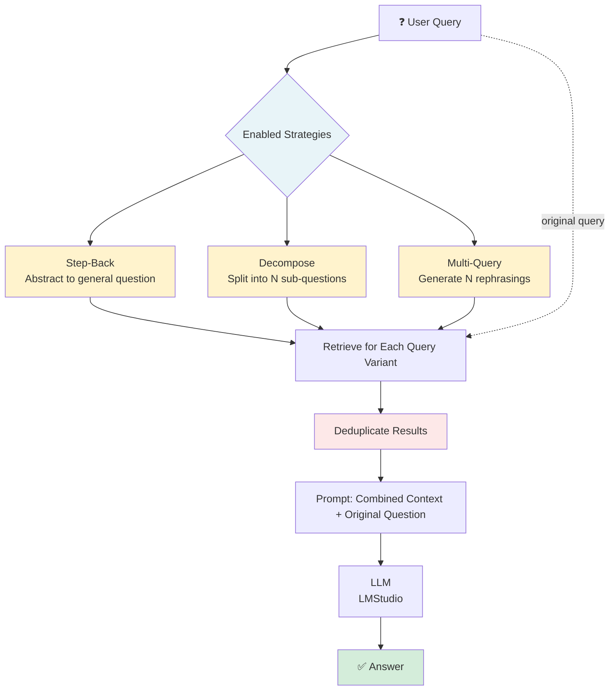
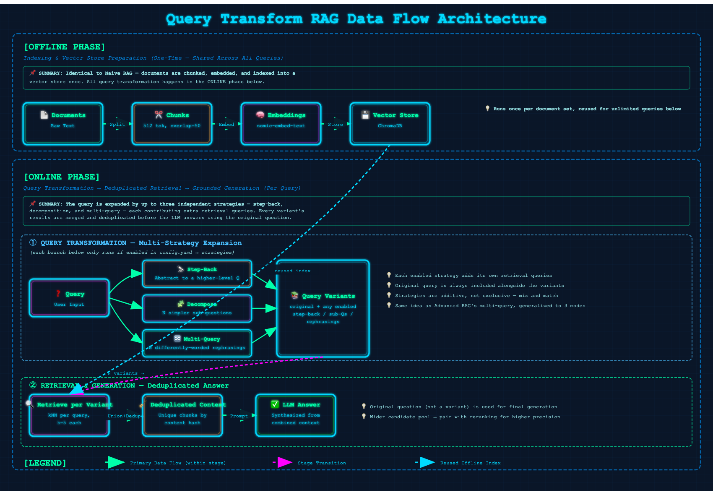

# 04 · Query Transform RAG

> **Category:** Query Enhancement  
> **Complexity:** ⭐⭐☆☆☆  
> **Latency:** 🟡 Medium (1-3 extra LLM calls per query, depending on enabled strategies)  
> **Accuracy:** 🟢 High (especially for complex, ambiguous, or multi-hop questions)  
> **Reference:** [NirDiamant/RAG_Techniques](https://github.com/NirDiamant/RAG_Techniques)

---

## What Is It?

Query Transform RAG tackles the same underlying problem as HyDE — a single raw user query is often a poor retrieval signal — but attacks it from three different angles instead of one:

1. **Step-back:** Abstract the query into a more general, higher-level question. Useful when the user asks something overly specific but the answer requires broader context.
2. **Decompose:** Break a complex or multi-part question into simpler sub-questions, retrieve for each, and let the LLM synthesize across them. Useful for multi-hop questions.
3. **Multi-query:** Generate several differently-worded variants of the query and retrieve for each. Classic recall-boosting trick — different phrasings surface different relevant chunks.

All three strategies are independently toggleable (`config.yaml → rag_techniques.query_transform_rag.strategies`). Every enabled strategy contributes additional retrieval queries; results are merged and deduplicated before the final answer is generated from the *original* question plus the combined context.

---

## Flowchart



---

## Data Flow Diagram

The complete Query Transform RAG pipeline consists of two phases:

### Offline Phase (Indexing)
**Documents → Chunks → Embeddings → Vector Store**

Identical to Naive RAG — documents are chunked, embedded, and indexed once. All query transformation happens in the online phase below.

### Online Phase (Query)
**Query → [Step-Back / Decompose / Multi-Query] → Retrieve per Variant → Deduplicate → LLM (Combined Context + Original Question) → Answer**

Each enabled strategy expands the original query into one or more additional retrieval queries. Every variant (plus the original) is used to retrieve top-K chunks; the union is deduplicated by content before being handed to the LLM alongside the user's original question — so the answer is synthesized from a much broader candidate set than a single-query retrieval would surface.



---

## Implementation Files

| File | Framework | Key Features |
|------|-----------|--------------|
| `langchain_impl.py` | LangChain | LCEL prompt chains for step-back/decompose/multi-query, deduplicated retrieval |
| `llamaindex_impl.py` | LlamaIndex | Direct LLM `.complete()` calls per strategy, `VectorStoreIndex` retriever |

---

## Key Configuration (config.yaml)

```yaml
rag_techniques:
  query_transform_rag:
    enabled: true
    strategies:
      - step_back             # Abstract the query to a higher level
      - decompose             # Break complex query into sub-questions
      - multi_query           # Generate N query variations
    num_queries: 3             # Sub-questions / variants per strategy

retrieval:
  top_k: 5                     # Chunks retrieved per query variant (before dedup)
```

Disable any strategy by removing it from the `strategies` list — e.g. keep only `multi_query` for a lighter-weight, single-LLM-call-per-strategy setup.

---

## Pros & Cons

| ✅ Pros | ❌ Cons |
|---------|---------|
| Improves recall from three independent angles at once | 1-3 extra LLM calls per query (latency & cost) |
| Decomposition handles multi-hop questions Naive RAG misses | More retrieval queries → more candidates to dedupe and rank |
| Step-back helps when the query is too narrow for the docs | Quality depends on the LLM's ability to reformulate well |
| Each strategy is independently toggleable | No reranking built in — precision may suffer with a wide candidate set (pair with Reranking RAG) |

---

## When to Use Query Transform RAG

**✅ Perfect for:**
- Complex, multi-hop questions ("How does X affect Y, given Z?")
- Ambiguous or under-specified queries
- Knowledge bases where the right context lives at a different abstraction level than the question
- Improving recall before adding a reranking stage

**❌ Consider alternatives when:**
- Queries are already simple and well-matched to document vocabulary → Naive RAG is enough
- Latency budget is tight (each extra strategy is another LLM round-trip) → use a single strategy or HyDE instead
- Vocabulary mismatch (not query complexity) is the core problem → HyDE is a more targeted fix
- You need cross-encoder precision on top of recall → combine with Reranking RAG or use Advanced RAG directly

---

## Architecture Notes

- **Strategies are additive, not exclusive** — each enabled strategy contributes its own retrieval queries on top of the original question; nothing is dropped. This maximizes recall at the cost of more retrieval + generation work.
- **Decomposition sub-questions and multi-query variants are generated with the same LLM call pattern** (one prompt, N lines of output) — this keeps the LangChain and LlamaIndex implementations structurally parallel and easy to compare.
- **No reranking here by design** — Query Transform RAG's job is to widen the candidate pool. If precision on the merged set matters, chain this with Reranking RAG or borrow Advanced RAG's cross-encoder step.
- **Deduplication is content-hash based** (first 100 chars), same approach used in Advanced RAG's multi-query retriever — cheap and effective for chunk-level dedup.
