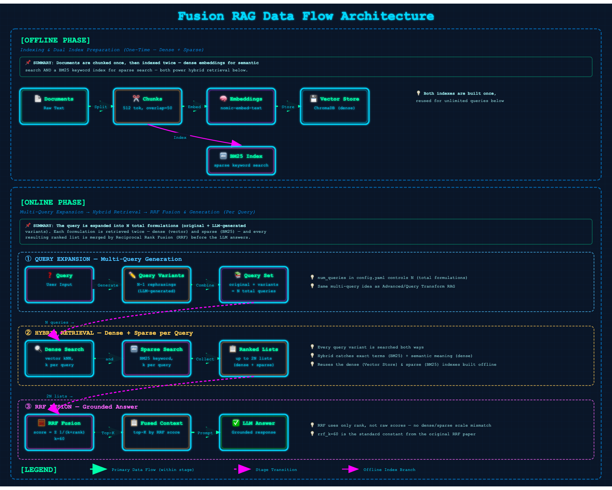

# 05 · Fusion RAG (RAG-Fusion)

> **Category:** Retrieval Enhancement  
> **Complexity:** ⭐⭐⭐☆☆  
> **Latency:** 🟡 Medium (multi-query LLM call + 2× retrieval passes per query)  
> **Accuracy:** 🟢 High (robust ranking without a separate reranking stage)  
> **Reference:** [NirDiamant/RAG_Techniques](https://github.com/NirDiamant/RAG_Techniques)  
> **Paper:** ["Reciprocal Rank Fusion outperforms Condorcet and Individual Rank Learning Methods" — Cormack et al., 2009](https://plg.uwaterloo.ca/~gvcormac/cormacksigir09-rrf.pdf)

---

## What Is It?

Fusion RAG (RAG-Fusion) tackles the same recall problem as Advanced/Query Transform RAG — a single query and a single retrieval pass often miss relevant chunks — but combines two complementary ideas instead of one:

1. **Multi-query expansion:** Generate several rephrasings of the query (same idea used elsewhere in this repo).
2. **Hybrid retrieval:** Retrieve each query formulation *twice* — once with dense (embedding) search and once with sparse (BM25 keyword) search — so exact-term matches and semantic matches are both covered.

The key difference from Query Transform RAG is **how the results are combined**. Instead of a simple union+dedup, Fusion RAG merges every ranked list with **Reciprocal Rank Fusion (RRF)**:

```
score(doc) = Σ  1 / (rrf_k + rank_of(doc, list))
             over every ranked list the doc appears in
```

RRF only looks at *rank*, never raw similarity/BM25 scores — which matters because dense cosine-similarity scores and sparse BM25 scores live on completely different, incompatible scales. A document that ranks consistently well across several query variants and both retrieval methods rises to the top, even if it was never the single best hit in any one list.

---

## Flowchart

```mermaid
flowchart TD
    A[❓ User Query] --> B[Generate N-1 Query Variants]
    B --> C[Query Set: original + variants]

    C --> D{For each query}
    D --> E[Dense Search\nvector kNN]
    D --> F[Sparse Search\nBM25 keyword]

    E --> G[Ranked Lists\nup to 2N lists]
    F --> G

    G --> H[Reciprocal Rank Fusion\nscore = Σ 1/(k+rank)]
    H --> I[Top-K Fused Context]
    I --> J[Prompt Template\nContext + Question]
    J --> K[LLM\nLMStudio]
    K --> L[✅ Answer]

    style B fill:#e8f4f8
    style G fill:#fff3cd
    style H fill:#fde8e8
    style L fill:#d4edda
```

---

## Data Flow Diagram

The complete Fusion RAG pipeline consists of two phases:

### Offline Phase (Indexing)
**Documents → Chunks → [Embeddings → Vector Store] + [BM25 Index]**

Documents are chunked once, then indexed *twice*: dense embeddings into ChromaDB for semantic search, and a BM25 keyword index for sparse search. Both indexes are reused for every query.

### Online Phase (Query)
**Query → Multi-Query Expansion → Hybrid Retrieval (dense + sparse per query) → Reciprocal Rank Fusion → LLM → Answer**

The query is expanded into N total formulations. Each formulation is searched against both indexes, producing up to 2N ranked lists. RRF fuses all of them into a single ranking by rank position alone — sidestepping the dense/sparse score-scale mismatch — and the top-K fused chunks ground the final answer.



---

## Implementation Files

| File | Framework | Key Features |
|------|-----------|--------------|
| `langchain_impl.py` | LangChain | `BM25Retriever` + Chroma, hand-rolled RRF over both ranked lists |
| `llamaindex_impl.py` | LlamaIndex | Native `QueryFusionRetriever` (RECIPROCAL_RANK mode) fusing a vector retriever + `BM25Retriever` |

Both gracefully fall back to dense-only retrieval if the BM25 dependency (`rank-bm25` / `llama-index-retrievers-bm25`) is unavailable, logging a warning instead of failing.

---

## Key Configuration (config.yaml)

```yaml
rag_techniques:
  fusion_rag:
    enabled: true
    num_queries: 4       # Total query formulations (original + 3 LLM-generated variants)
    rrf_k: 60            # RRF constant — 60 is the value the original paper found near-optimal
    hybrid_search: true  # Combine dense (vector) + sparse (BM25) retrieval

retrieval:
  top_k: 5               # Chunks retrieved per query per method, and final fused result count
```

---

## Pros & Cons

| ✅ Pros | ❌ Cons |
|---------|---------|
| RRF combines dense + sparse signals without score calibration | Extra LLM call for query generation + up to 2× retrieval passes per query |
| Robust ranking without a separate cross-encoder reranking stage | More moving parts than a single-index retriever (two indexes to build & keep in sync) |
| BM25 catches exact keyword/code/ID matches dense embeddings miss | BM25 index must be rebuilt whenever documents are re-indexed |
| Well-studied, parameter-light fusion algorithm (just `rrf_k`) | Latency scales with `num_queries` × 2 retrieval calls |

---

## When to Use Fusion RAG

**✅ Perfect for:**
- Diverse document sets where some content favors exact keyword matches (IDs, code, names) and some favors semantic similarity
- Production search systems that want better ranking without adding a reranker model
- When a single retrieval pass — dense or sparse alone — misses relevant documents

**❌ Consider alternatives when:**
- Latency budget is tight → the multi-query + dual-retrieval combination is one of the more expensive techniques here
- Document corpus is small/homogeneous enough that dense-only retrieval already works well → Naive RAG is enough
- You specifically need cross-encoder-level precision on top of recall → pair with Reranking RAG, or reach for Advanced RAG's reranking stage instead

---

## Architecture Notes

- **RRF's core advantage is rank-only fusion.** Dense cosine similarity and BM25 scores aren't comparable numbers — averaging or summing them directly would be meaningless. RRF sidesteps this by only using each document's *rank* in each list, which is why it works cleanly across heterogeneous retrieval methods.
- **`rrf_k=60`** is the constant from the original Cormack et al. paper and is deliberately not aggressively tuned per-technique elsewhere in this repo — it controls how much weight lower ranks still get (higher k flattens the curve, giving low ranks more relative credit).
- **LlamaIndex's `QueryFusionRetriever` hard-codes k=60 internally** in RECIPROCAL_RANK mode, which conveniently already matches this project's config default — no extra wiring needed to keep the two framework implementations aligned.
- **Hybrid search degrades gracefully.** If `rank-bm25` (LangChain) or `llama-index-retrievers-bm25` (LlamaIndex) isn't installed, both implementations catch the failure, log a warning, and fall back to dense-only retrieval rather than crashing — the same defensive pattern used for optional imports elsewhere in this repo (e.g. Advanced RAG's `MultiQueryRetriever`/`CrossEncoderReranker`).
