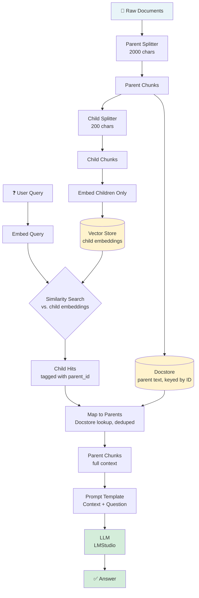
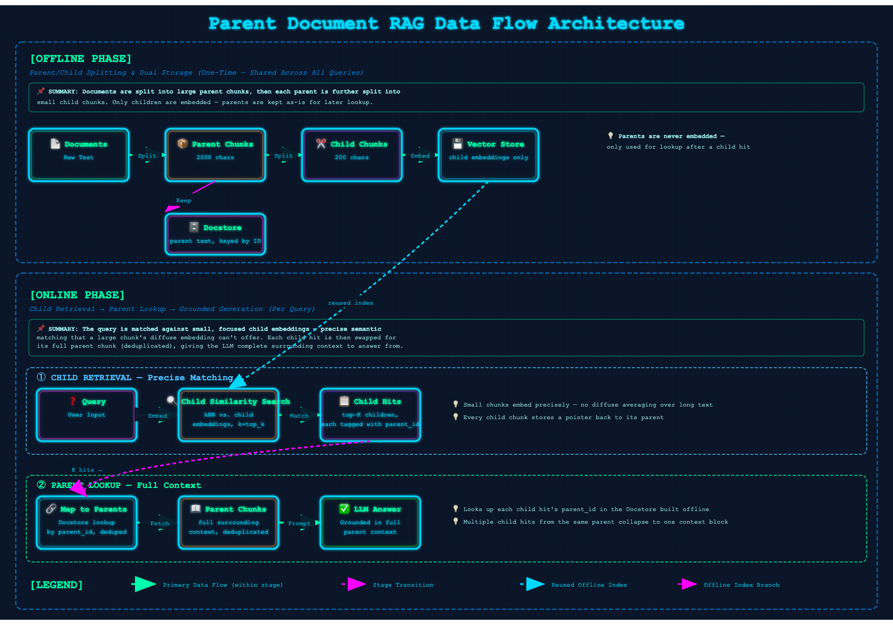

# 06 · Parent Document RAG

> **Category:** Chunking Strategy  
> **Complexity:** ⭐⭐☆☆☆  
> **Latency:** 🟢 Low (no extra LLM calls — just a doc-store lookup after retrieval)  
> **Accuracy:** 🟢 High (resolves the precision-vs-context tension in chunk sizing)  
> **Reference:** [NirDiamant/RAG_Techniques](https://github.com/NirDiamant/RAG_Techniques)

---

## What Is It?

Naive RAG faces a chunk-size dilemma: **small chunks embed and match queries precisely, but lack surrounding context; large chunks carry more context, but their embeddings become diffuse averages that match queries poorly.** You can't win by picking one chunk size — precision and context pull in opposite directions.

Parent Document RAG resolves this by decoupling *what gets searched* from *what gets returned*:

1. Split documents into large **parent** chunks (e.g. 2000 characters).
2. Split each parent further into small **child** chunks (e.g. 200 characters).
3. Embed and index **only the children** — small, focused text that matches queries precisely.
4. At query time, retrieve by child similarity, then **swap each child hit for its full parent chunk** before generation.

The LLM never sees a tiny 200-character fragment — it gets the complete parent context the fragment came from, while retrieval still benefited from the child chunk's precise, focused embedding.

---

## Flowchart



---

## Data Flow Diagram

The complete Parent Document RAG pipeline consists of two phases:

### Offline Phase (Indexing)
**Documents → Parent Chunks → Child Chunks → [Embeddings → Vector Store] + [Docstore]**

Documents are split into large parent chunks, then each parent is further split into small child chunks. Only the children are embedded and stored in the vector store; the parents are kept as-is in a docstore, keyed by ID, for lookup after retrieval.

### Online Phase (Query)
**Query → Child Similarity Search → Child Hits (tagged with parent_id) → Map to Parents (deduplicated) → LLM → Answer**

The query is matched against small, focused child embeddings — precise semantic matching a large chunk's diffuse embedding can't offer. Each child hit is then swapped for its full parent chunk via a docstore lookup; multiple child hits from the same parent collapse into a single context block before generation.



---

## Implementation Files

| File | Framework | Key Features |
|------|-----------|--------------|
| `langchain_impl.py` | LangChain | Built-in `ParentDocumentRetriever` (Chroma vectorstore + `InMemoryStore` docstore) |
| `llamaindex_impl.py` | LlamaIndex | Manual parent/child `SentenceSplitter` pass — child nodes tagged with `parent_id` metadata, `VectorStoreIndex` built over children only |

---

## Key Configuration (config.yaml)

```yaml
rag_techniques:
  parent_document_rag:
    enabled: true
    parent_chunk_size: 2000  # Large chunks returned to the LLM for context
    child_chunk_size: 200    # Small chunks embedded and searched

retrieval:
  top_k: 5                   # Child chunks retrieved per query (before parent dedup)
```

---

## Pros & Cons

| ✅ Pros | ❌ Cons |
|---------|---------|
| Resolves the precision-vs-context chunk-size tradeoff directly | Two stores to manage instead of one (vector store + docstore) |
| No extra LLM calls — just a docstore lookup, so latency stays low | The default docstore (`InMemoryStore`) doesn't persist across process restarts |
| Simple mental model: search small, read big | Parent chunks can still exceed the LLM's context window if sized too large |
| Works well even without query rewriting or reranking | Doesn't improve recall for queries that don't match *any* child's wording |

---

## When to Use Parent Document RAG

**✅ Perfect for:**
- Long documents where a single good chunk size doesn't exist — technical manuals, books, legal contracts, research papers
- When retrieved snippets keep missing context that was one paragraph away
- Low-latency requirements — this is one of the cheaper techniques here (no extra LLM round-trips)

**❌ Consider alternatives when:**
- Documents are already short enough that parent/child splitting adds no value → Naive RAG is enough
- You need production-grade persistence for the parent docstore → swap `InMemoryStore` for a file- or database-backed store (see Architecture Notes)
- The problem is queries not matching document vocabulary at all (not chunk size) → HyDE or Query Transform RAG address that more directly

---

## Architecture Notes

- **This is a chunking-strategy fix, not a query-understanding fix.** It doesn't rewrite queries, expand them, or rerank results — it solves a structural problem in how documents are represented for search, orthogonal to the query-side techniques elsewhere in this repo (and combinable with them).
- **The `InMemoryStore` docstore is a demo-friendly default, not a production one.** Parent chunk text lives only in process memory in this implementation — restart the process and it's gone (the vector store's child embeddings persist via ChromaDB, but the docstore does not). A production deployment should use LangChain's `LocalFileStore` / a Redis-backed store, or the LlamaIndex equivalent, so parent lookups survive restarts.
- **The LlamaIndex implementation reimplements this manually** rather than using LlamaIndex's `AutoMergingRetriever` + `HierarchicalNodeParser`, which solve a related but more general problem (N-level hierarchies with configurable merge thresholds). A direct single-level parent/child split keeps the two framework implementations structurally comparable.
- **Tune `parent_chunk_size` to your LLM's context window budget** — it's the piece that actually lands in the prompt. `child_chunk_size` only needs to be small enough to embed precisely; it's never shown to the LLM directly.
