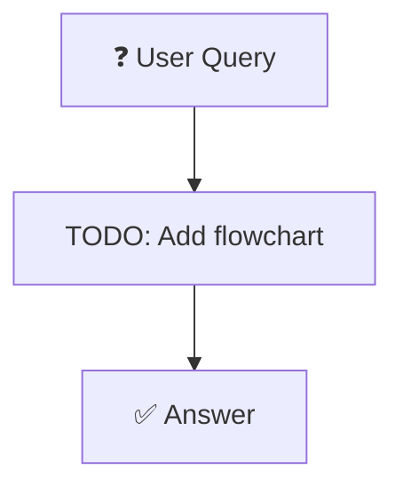

# reranking_rag · Reranking Rag

> **Status:** 🔧 Stub — implementation pending  
> **Reference:** [NirDiamant/RAG_Techniques](https://github.com/NirDiamant/RAG_Techniques)

---

## Overview

TODO: Add detailed description, flowchart, use cases, pros/cons, and architecture notes.

See `langchain_impl.py` for the implementation stub.  
Follow the pattern established in `01_naive_rag/README.md`.

---

## Flowchart

---

## When to Use

TODO: Add use case guidance.

---

## Implementation Status

| File | Status |
|------|--------|
| `langchain_impl.py` | 🔧 Stub |
| `llamaindex_impl.py` | 🔧 Not started |
