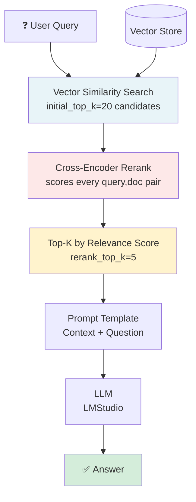
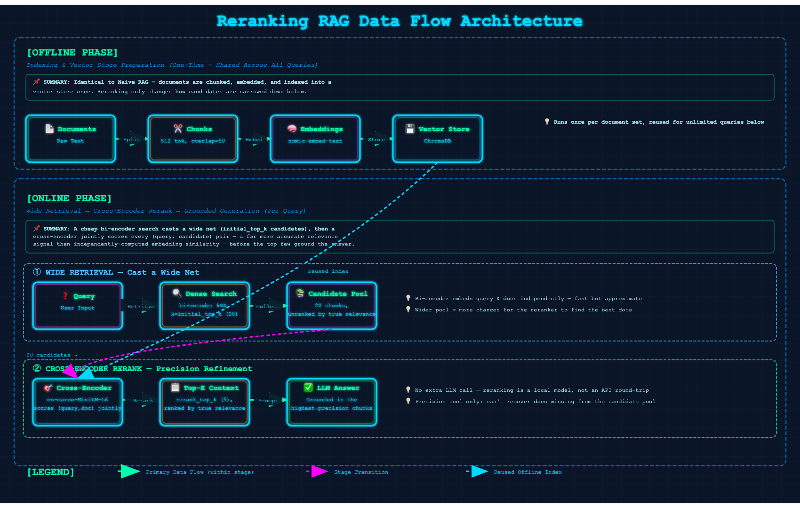

# 07 · Reranking RAG

> **Category:** Retrieval Enhancement  
> **Complexity:** ⭐⭐☆☆☆  
> **Latency:** 🟡 Medium (cross-encoder scores every candidate against the query)  
> **Accuracy:** 🟢 High (highest-precision single addition to Naive RAG)  
> **Reference:** [NirDiamant/RAG_Techniques](https://github.com/NirDiamant/RAG_Techniques)

---

## What Is It?

Reranking RAG isolates the single highest-ROI improvement over Naive RAG: **cross-encoder reranking**. Where Advanced RAG bundles reranking together with query rewriting and multi-query retrieval, and Fusion RAG fuses several ranked lists via RRF, Reranking RAG does exactly one thing well — cast a wide retrieval net, then re-score every candidate with a model that actually reads the query and document together.

The initial vector search uses a **bi-encoder**: the query and every document are embedded *independently*, and similarity is just a distance between two pre-computed vectors. That's fast enough to search millions of chunks, but it's a lossy approximation — the model never actually looks at the query and a specific document side by side.

A **cross-encoder** does exactly that: it takes the (query, document) pair *together* as input and outputs a single relevance score. Far more accurate, but it can't be precomputed or indexed — it has to run once per candidate at query time. So the pattern is: retrieve a wide, cheap candidate pool with the bi-encoder (dense search), then spend the expensive cross-encoder pass only on those candidates.

---

## Flowchart


```mermaid
flowchart TD
    A[❓ User Query] --> B[Vector Similarity Search\ninitial_top_k=20 candidates]
    D[(Vector Store)] --> B
    B --> C[Cross-Encoder Rerank\nscores every query,doc pair]
    C --> E[Top-K by Relevance Score\nrerank_top_k=5]
    E --> F[Prompt Template\nContext + Question]
    F --> G[LLM\nLMStudio]
    G --> H[✅ Answer]

    style B fill:#e8f4f8
    style C fill:#fde8e8
    style E fill:#fff3cd
    style H fill:#d4edda
```

---

## Data Flow Diagram

The complete Reranking RAG pipeline consists of two phases:

### Offline Phase (Indexing)
**Documents → Chunks → Embeddings → Vector Store**

Identical to Naive RAG — documents are chunked, embedded, and indexed once. Reranking only changes how candidates are narrowed down at query time.

### Online Phase (Query)
**Query → Wide Dense Retrieval (top-20) → Cross-Encoder Rerank (query, doc pairs) → Top-K → LLM → Answer**

Retrieval first casts a wide net with the cheap bi-encoder search, then a cross-encoder re-scores every candidate jointly with the query — a fundamentally more accurate relevance signal than cosine similarity between independently-computed embeddings — before the top few make it into the final prompt.



---

## Implementation Files

| File | Framework | Key Features |
|------|-----------|--------------|
| `langchain_impl.py` | LangChain | `HuggingFaceCrossEncoder` + `CrossEncoderReranker` compressor over a wide Chroma retriever |
| `llamaindex_impl.py` | LlamaIndex | `SentenceTransformerRerank` node postprocessor on the query engine |

Both gracefully fall back to plain dense top-K if the cross-encoder model can't load, logging a warning instead of failing.

---

## Key Configuration (config.yaml)

```yaml
rag_techniques:
  reranking_rag:
    enabled: true
    initial_top_k: 20        # Candidates retrieved before reranking
    rerank_top_k: 5           # Docs kept after reranking
    reranker_model: "cross-encoder/ms-marco-MiniLM-L-6-v2"
```

---

## Pros & Cons

| ✅ Pros | ❌ Cons |
|---------|---------|
| Highest-ROI single addition over Naive RAG's retrieval | Cross-encoder inference adds latency proportional to `initial_top_k` |
| No extra LLM calls — reranking is a local model, not an API round-trip | Reranker model must be downloaded/loaded (extra local compute) |
| Simple to reason about: one clear extra step, no query rewriting | Doesn't improve recall — if the relevant doc isn't in the initial candidate pool, reranking can't surface it |
| Composable — pair with any other technique's retrieval stage | Cross-encoder quality varies by domain; general-purpose models may underperform on specialized text |

---

## When to Use Reranking RAG

**✅ Perfect for:**
- Naive RAG's bi-encoder retrieval is finding the right documents, but ranking them poorly (relevant doc is at rank 8, not rank 2)
- Precision matters more than recall — legal, medical, compliance-style domains
- You want an accuracy boost without the latency/cost of extra LLM calls (query rewriting, multi-query, etc.)

**❌ Consider alternatives when:**
- The relevant documents aren't being retrieved at all in the initial pass → the problem is recall, not ranking — look at Query Transform RAG, Fusion RAG, or HyDE instead
- Latency budget can't absorb cross-encoder inference over 20+ candidates → Naive RAG or a smaller `initial_top_k`
- You need both wider recall *and* precision → combine with multi-query retrieval (this is exactly what Advanced RAG does)

---

## Architecture Notes

- **Bi-encoder vs. cross-encoder is the core tradeoff.** Bi-encoders (used for the initial vector search) trade accuracy for speed by encoding query and documents independently, enabling precomputed embeddings and sub-linear search. Cross-encoders trade speed for accuracy by jointly encoding the pair — no precomputation possible, hence the two-stage "retrieve wide, then rerank narrow" pattern.
- **`initial_top_k` controls the recall/latency tradeoff.** A wider candidate pool gives the reranker more chances to find the truly best documents, at the cost of more cross-encoder passes. 20 is a reasonable default; push higher only if you suspect relevant docs are ranking outside the top 20 in the initial dense pass.
- **This is the same reranker used inside Advanced RAG** (`cross-encoder/ms-marco-MiniLM-L-6-v2`), extracted here as a standalone technique so its effect can be measured and understood in isolation, without the confounding factor of query rewriting or multi-query retrieval.
- **Reranking is purely a precision tool, not a recall tool** — it can only reorder what was already retrieved. If the answer depends on a chunk the initial dense search never surfaced, no amount of reranking recovers it.
