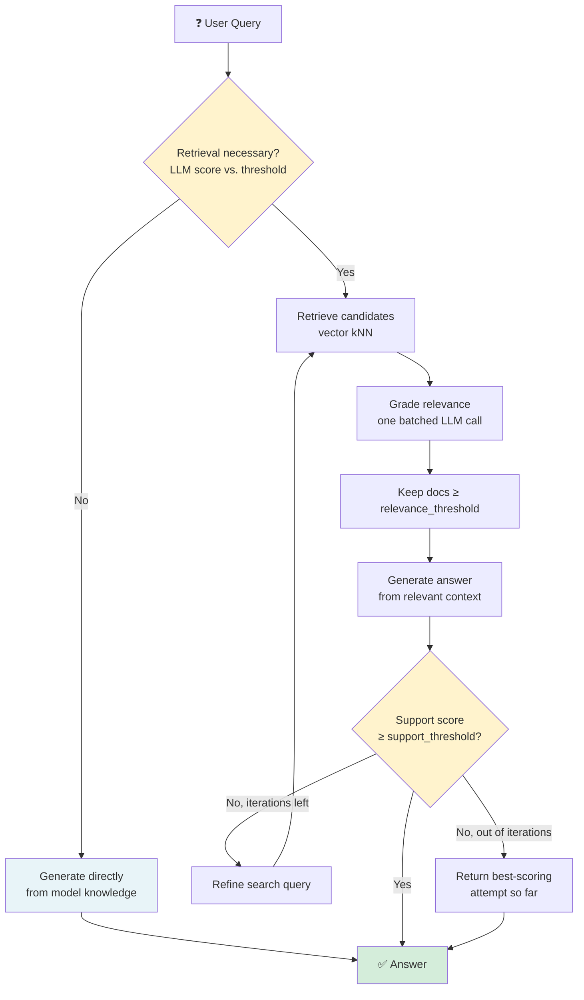
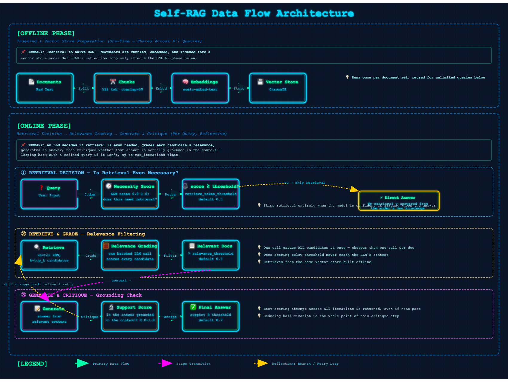

# 08 · Self-RAG (Self-Reflective RAG)

> **Category:** Adaptive & Self-Reflective  
> **Complexity:** ⭐⭐⭐⭐☆  
> **Latency:** 🔴 High (multiple LLM calls per query: decide, grade, generate, critique, possibly repeat)  
> **Accuracy:** 🟢 High (explicit grounding checks reduce hallucination)  
> **Reference:** [NirDiamant/RAG_Techniques](https://github.com/NirDiamant/RAG_Techniques)  
> **Paper:** ["Self-RAG: Learning to Retrieve, Generate, and Critique through Self-Reflection" — Asai et al., 2023](https://arxiv.org/abs/2310.11511)

---

## What Is It?

Every technique before this one in the repo (Tiers 1-2) is a **linear pipeline**: query in, fixed sequence of steps, answer out. Self-RAG is the first technique here that introduces actual **control flow** — the pipeline makes decisions and can loop back on itself.

The original paper fine-tunes a model to emit special "reflection tokens" (`Retrieve`, `ISREL`, `ISSUP`, `ISUSE`) inline during generation, letting the model itself control retrieval and self-critique as part of its native output. Without a model fine-tuned for those tokens, this implementation reproduces the same *behavior* through structured prompting against any general-purpose chat LLM:

1. **Retrieval decision** — does this question even need external documents, or can the model answer it accurately from its own knowledge? (Skips retrieval entirely when it doesn't.)
2. **Relevance grading** — score every retrieved candidate; keep only the ones that clear the bar.
3. **Generation** — answer from the relevant context (or directly, if retrieval was skipped).
4. **Support critique** — score how well the generated answer is actually grounded in the context.
5. **Reflect & retry** — if the answer isn't well-supported, reformulate the search query and go again, up to `max_iterations` times. The best-scoring attempt across all iterations is what gets returned.

---

## Flowchart



---

## Data Flow Diagram

The complete Self-RAG pipeline consists of two phases:

### Offline Phase (Indexing)
**Documents → Chunks → Embeddings → Vector Store**

Identical to Naive RAG — documents are chunked, embedded, and indexed once. Self-RAG's reflection loop only affects the online phase.

### Online Phase (Query, Reflective)
**Query → Retrieval Decision → [skip → Direct Answer] or [Retrieve → Grade Relevance → Generate → Critique Support → (retry if weak)] → Answer**

An LLM first decides whether retrieval is even necessary — genuinely skipping it when the model is confident it already knows the answer. If retrieval proceeds, every candidate is relevance-graded in one batched call, the answer is generated from what survives, and a final critique step scores how well-grounded that answer actually is. A weak score triggers a retry with a reformulated query, up to `max_iterations` times; the best-scoring attempt across all iterations is what's returned.



---

## Implementation Files

| File | Framework | Key Features |
|------|-----------|--------------|
| `langchain_impl.py` | LangChain | LCEL prompt chains for each reflection step, batched relevance grading, iterative retry loop |
| `llamaindex_impl.py` | LlamaIndex | Same control flow via direct `llm.complete()` calls, `<think>`-tag stripping for reasoning models |

---

## Key Configuration (config.yaml)

```yaml
rag_techniques:
  self_rag:
    enabled: true
    max_iterations: 3               # Max retrieve→generate→critique retries
    retrieve_token_threshold: 0.5   # Score above which retrieval is triggered
    relevance_threshold: 0.6        # Score above which a candidate doc is kept
    support_threshold: 0.7          # Score above which an answer is accepted as grounded

retrieval:
  top_k: 5                          # Candidates retrieved per iteration (before relevance filtering)
```

---

## Pros & Cons

| ✅ Pros | ❌ Cons |
|---------|---------|
| Skips retrieval entirely on questions that don't need it — saves cost | Multiple sequential LLM calls per query, even in the best case |
| Explicit relevance grading filters noisy candidates before they reach generation | Worst case (max_iterations reached) can mean 10+ LLM calls for one answer |
| Explicit groundedness critique directly targets hallucination | Reflection quality depends entirely on how well the LLM follows the grading prompts |
| Adapts its own effort to the question — cheap questions stay cheap | No fine-tuned reflection tokens here — this is a prompted approximation, not the paper's trained behavior |

---

## When to Use Self-RAG

**✅ Perfect for:**
- Mixed workloads where some questions need retrieval and others don't (FAQ-style + general knowledge in the same interface)
- Reducing hallucination is the top priority and extra latency is acceptable
- You want visibility into *why* an answer was trusted (relevance scores, support scores are all in `intermediate_steps`)

**❌ Consider alternatives when:**
- Latency or cost budget can't absorb several sequential LLM calls per query → a Tier 2 technique (Reranking RAG, Advanced RAG) gets most of the accuracy benefit for far less
- Retrieval is *always* needed for your domain (e.g. proprietary internal docs) → the retrieval-decision step adds a call that will basically always say "yes," so it's pure overhead — skip straight to Advanced/Reranking RAG
- You need guaranteed low iteration count → Corrective RAG's single-pass correction is a cheaper way to handle poor retrieval quality

---

## Architecture Notes

- **This is a control-flow technique, not a retrieval-enhancement technique.** Every Tier 2 technique changes *how* retrieval happens; Self-RAG changes *whether and how many times* the whole retrieve-generate cycle happens. It's the first technique in this repo where the pipeline itself makes decisions.
- **Reflection is simulated, not trained.** The original paper's model was fine-tuned to emit reflection tokens as part of normal decoding — cheap and tightly integrated. Prompting a general-purpose model for the same judgments is a practical substitute, but it costs a full extra LLM round-trip per reflection point and is only as reliable as the model's ability to follow a scoring instruction.
- **Relevance grading is batched deliberately.** Scoring `top_k` candidates one-at-a-time would mean `top_k` extra LLM calls per iteration; a single call that scores all candidates at once (numbered list in, numbered list of scores out) keeps this from becoming prohibitively slow.
- **The best-scoring attempt always wins**, even if it never clears `support_threshold`. Self-RAG degrades gracefully — a weakly-supported best-effort answer beats returning nothing after `max_iterations` retries.
- **The retrieval-decision step is the main cost-saving lever.** If your corpus is something the base model already knows well (like common knowledge), this step will legitimately skip retrieval often — that's a feature, not a bug, but it means Self-RAG's benefit is domain-dependent: highly specialized/private corpora will trigger retrieval nearly every time, making that first decision call pure overhead.
