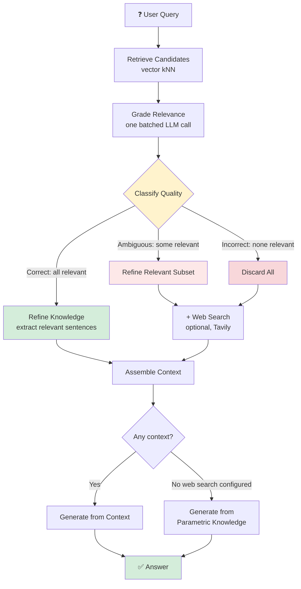
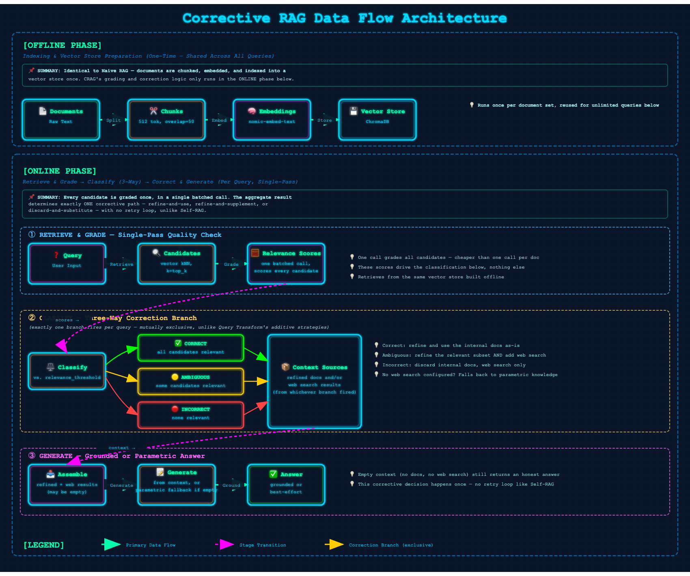

# 09 · Corrective RAG (CRAG)

> **Category:** Adaptive & Self-Reflective  
> **Complexity:** ⭐⭐⭐⭐☆  
> **Latency:** 🔴 High (grading + refinement + optional web search, all before generation)  
> **Accuracy:** 🟢 Very High (explicitly corrects for bad retrieval instead of trusting it)  
> **Reference:** [NirDiamant/RAG_Techniques](https://github.com/NirDiamant/RAG_Techniques)  
> **Paper:** ["Corrective Retrieval Augmented Generation" — Yan et al., 2024](https://arxiv.org/abs/2401.15884)

---

## What Is It?

Corrective RAG (CRAG) shares Self-RAG's core insight — retrieval quality should be checked, not trusted blindly — but implements it very differently. Self-RAG **iterates**: retrieve, critique, and if the answer isn't grounded, reformulate the query and try the whole cycle again. CRAG instead **grades once and corrects once**: it evaluates the initial retrieval, classifies it into one of three quality buckets, and takes a single corrective action based on that classification — no retry loop.

1. **Retrieve** a candidate pool as usual.
2. **Grade every candidate's relevance** to the question in one batched call.
3. **Classify** the overall result:
   - **Correct** — every candidate is relevant. Use them (refined).
   - **Ambiguous** — some candidates are relevant, some aren't. Use the relevant subset (refined) *and* supplement with web search.
   - **Incorrect** — nothing retrieved is relevant. Discard it all, fall back to web search.
4. **Refine** the surviving documents — a simplified version of the paper's "decompose-then-recompose": extract only the sentences that actually answer the question, discarding filler, rather than keeping whole documents wholesale.
5. **Generate** from whatever context resulted (refined docs, web results, both, or — if no web search is configured — a parametric-knowledge fallback).

---

## Flowchart



---

## Data Flow Diagram

The complete Corrective RAG pipeline consists of two phases:

### Offline Phase (Indexing)
**Documents → Chunks → Embeddings → Vector Store**

Identical to Naive RAG — documents are chunked, embedded, and indexed once. CRAG's grading and correction logic only runs in the online phase.

### Online Phase (Query, Single-Pass Corrective)
**Query → Retrieve → Grade Relevance → Classify (Correct / Ambiguous / Incorrect) → Refine and/or Web Search → Generate → Answer**

Every candidate is graded once, in a single batched call. The aggregate result determines exactly one corrective path — refine-and-use, refine-and-supplement, or discard-and-substitute — with no retry loop. Missing web search configuration degrades gracefully to the model's own parametric knowledge rather than failing.



---

## Implementation Files

| File | Framework | Key Features |
|------|-----------|--------------|
| `langchain_impl.py` | LangChain | LCEL prompt chains for grading/refinement, optional `TavilySearchResults` web search |
| `llamaindex_impl.py` | LlamaIndex | Same single-pass classification via direct `llm.complete()` calls |

Both gracefully fall back to parametric-knowledge generation if `web_search_fallback` is enabled but no Tavily API key is configured, or if the web search call itself fails.

---

## Key Configuration (config.yaml)

```yaml
rag_techniques:
  corrective_rag:
    enabled: true
    relevance_threshold: 0.7    # Score above which a candidate counts as "relevant"
    web_search_fallback: false  # Set true + provide a Tavily key to enable web search
    tavily_api_key: null        # Or set the TAVILY_API_KEY environment variable instead

retrieval:
  top_k: 5                      # Candidates retrieved and graded per query
```

---

## Pros & Cons

| ✅ Pros | ❌ Cons |
|---------|---------|
| Single-pass — no retry loop, so latency is bounded and predictable | Still several sequential LLM calls (grade, refine, generate) even in the best case |
| Knowledge refinement strips filler before it ever reaches the LLM's context | Web search fallback needs an external API key to be genuinely useful — without it, "incorrect" retrieval just falls back to the model's own knowledge |
| Three-way classification handles partial relevance better than a binary keep/discard | Refinement is a single LLM call, not the paper's per-strip decompose/recompose algorithm — a simplification |
| Explicitly designed for incomplete or unreliable knowledge bases | Relevance grading quality depends on the LLM's ability to follow the scoring prompt, same as Self-RAG |

---

## When to Use Corrective RAG

**✅ Perfect for:**
- Knowledge bases that are known to be incomplete or occasionally stale
- High-stakes factual retrieval where silently answering from bad context is worse than admitting a gap
- Time-sensitive information, when paired with a real web search backend (news, current events, prices)

**❌ Consider alternatives when:**
- You need bounded, predictable latency and can't afford grading + refinement on every query → Reranking RAG gets a chunk of the precision benefit for one model pass, not several LLM calls
- Your knowledge base is comprehensive and rarely misses → the grading step becomes pure overhead, most queries will just be "correct" every time
- You want iterative refinement instead of a single corrective pass → Self-RAG's retry loop trades more latency for potentially better final answers

---

## Architecture Notes

- **Single-pass, not iterative — this is the key difference from Self-RAG.** Self-RAG can retry the whole retrieve-generate cycle up to `max_iterations` times with a reformulated query. CRAG grades once and corrects once; there's no loop here by design, which keeps worst-case latency bounded in a way Self-RAG's doesn't.
- **Three-way classification, not binary.** A naive approach would just discard low-relevance docs and keep the rest. CRAG's "ambiguous" bucket is what makes it distinct: partial relevance triggers *both* using what's good internally *and* reaching for an external source, rather than picking one or the other.
- **Web search is genuinely optional, and the code is honest about the difference.** With `web_search_fallback: false` (the default), "incorrect" classification falls back to the model's parametric knowledge — useful for demos and general-knowledge gaps, but not a substitute for real corrective retrieval against fresh external information. Wire up a real Tavily key if you want the "incorrect → search the web" path the paper actually describes.
- **Refinement is intentionally a single LLM call, not per-strip scoring.** The original paper's decompose-then-recompose algorithm operates at a finer grain (individual sentence/strip-level relevance). This implementation asks the LLM to do that extraction in one pass per query — a pragmatic trade of some precision for far fewer LLM calls, consistent with how relevance grading is also batched here.
